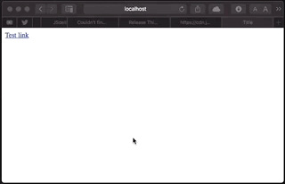

# Open in
> Let your users choose the app to open the link



## Get started
1. Include the stylesheet
	```html
	<link rel="stylesheet" href="https://cdn.jsdelivr.net/gh/gbougakov/openin/openin.min.css"/>
	```
2. Include the library at the end of body
	```html
	<script src="https://cdn.jsdelivr.net/gh/gbougakov/openin/openin.min.js"></script>
	```
3. Automatically bind the links
	```js
	openin.auto()
	```
4. Done!
## [Read the docs](https://oss.bygeorgenet.me/openin)